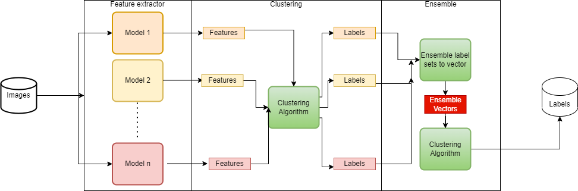

# Clustering Feature Embedding Vectors by Ensemble

>Unlike common graph datasets such as Citeseer, Cora and Pubmed with explicit link relation as edges (Kipf & Welling, 2017), face images do not contain explicit structural information, but only deep features extracted from a trained CNN model.


# Overview




# Feature extractor
We can use more Deep Convolution networks to extract features dict from dataset and save in pickle file `stores/model1.pth`
Model is available:
- Resnet
- MobileNet
- OSnet
- RegNet

```python
!python s1_extract_features.py \
    --a resnet50 --feature 512 --b 128 \
    --resume "/stores/checkpoints/resnet50.pth.tar"  \ 
    --data-dir "/stores/data/unlabel_image" \
    --store-dir "/stores/features/resnet50_feature.pth"

```

# Finetune-Clustering
## 1. Early Clustering

- In stages, each features dict stored in _pth file_ is clustered then labeled. If we have _N_ feature dicts, we will receive _N_ label dicts
- Some inherent algorithms:
  - [x] Kmeans
  - [x] DBScan
  - [ ] Adanet 


## 2. Ensemble Labels

- After early clustering, we use _N_ label dicts to create new feature vector space.
  - assume that, _i-th_ image  have N labels then we generate _i-th_ new feature vector: 
  
    $$v_i = [\text{label}_1, \text{label}_2, ..., \text{label}_\mathcal{N}]$$

  - N dicts is assembled to one new feature vector dict.
- Finally, with new feature vector dict, we apply extra clustering time on it and get last labels.


```python
#kmeans
!python s2_ensemble_clustering.py \
    --a kmeans --clusters 1000 \
    --feature-dir "/stores/features/" #for input
    --store-dir "/stores/ensemble"   #for saving 
    --flag-ensemble #update 28/07/22
```

```python
#dbscan
!python s2_ensemble_clustering.py \
    --a dbscan --dbs-eps 0.6 --dbs-min 3\
    --feature-dir "/stores/features/"
    --store-dir "/stores/ensemble"
    --flag-ensemble #new!
```

# Update

- <kbd>2022 - 27 Jul</kbd> integrated PCA. To use, set option:

    ```python
    !!python s2_ensemble_clustering.py  [...other options...] \
      --n-pca 128
    ```
- <kbd>2022 - 28 Jul</kbd> integrated reranking, default mode. 
  - Rerank mode will recompute distance metric, [ref](https://github.com/ewigspace1910/Paper-Notes-Deep-Learning/blob/main/Computer%20Vision/3.Person%20ReID/ReRankwKRE.md) 
  - To use, set option:

    ```python
    #to use ensemble clustering
    !!python s2_ensemble_clustering.py  [...other options...] \
      --flag-ensemble #call this flag
    ```

    ```python
    #to use rerank clustering
    !!python s2_ensemble_clustering.py  [...other options...] \
      --flag-single-rerank #call this flag
      --rerank #if set, orginal rerank method is used
    ```
